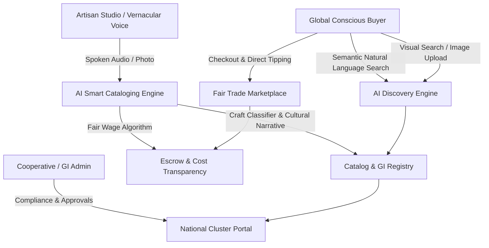

# KalaSetu AI (कलासेतु)
## AI-Driven Market Linkage & Smart Cataloging for Marginalized Artisans
**Topic Code: SIH26090 | Category: E-commerce + AI Search**

[](https://reactjs.org/)
[](https://www.typescriptlang.org/)
[](https://tailwindcss.com/)
[](https://expressjs.com/)
[](#)
[](#)

---

## Executive Summary

Marginalized traditional craftspeople (handloom weavers, terracotta potters, tribal metal smiths, lacquerware turners) face digital exclusion, lack English literacy for standard e-commerce taxonomies, and suffer under predatory middlemen who retain 60–80% of retail margins.

**KalaSetu AI** is an enterprise-grade SaaS marketplace and operating system purpose-built to solve these bottlenecks:
1. **Voice-Assisted AI Smart Cataloging**: Artisans speak freely in their native dialect (Hindi, Bengali, Tamil, Marathi, English). The AI transcribes the audio, detects the craft artform, generates cultural heritage narratives, translates listings into 5 languages simultaneously, and produces SEO-ready catalogs.
2. **Living Wage & Transparent Cost Algorithm**: Calculates fair artisan wages based on labor hours, raw material reimbursement, skill tiers, and local living wage indices—guaranteeing 70%+ of retail revenue goes directly to the artisan.
3. **Verifiable GI (Geographical Indication) Provenance**: Produces tamper-proof digital certificates with QR codes for each handcrafted piece, linking directly to cooperative registries.
4. **AI-Powered Discovery Engine**:
   - **Semantic Natural Language Search**: Handles complex conversational queries (e.g., *"handcrafted festive silk shawl under ₹5000"*).
   - **Visual Craft Matcher**: Image recognition matching uploaded craft photos against certified authentic artisan traditions.
5. **Multi-Perspective Experience**:
   - **Conscious Buyer Marketplace**: Notion/Linear-grade UI, transparent price breakdown, direct tipping, and live craft lifecycle tracking.
   - **Artisan Studio**: Direct escrow payout tracker, order fulfillment stages, and AI market trend forecasting.
   - **Cooperative & GI Admin Portal**: National artisan cluster heatmap, compliance monitoring, and GI verification approval queue.
   - **Kala-Mitra AI Copilot**: Omnipresent heritage and cataloging assistant accessible from any view.

---

## Key Features & Architecture



### 1. Smart Cataloging Studio (Artisan Hub)
- **Step 1: Visual Capture**: Upload smartphone photos or choose workshop presets.
- **Step 2: Vernacular Voice Recording**: Real-time microphone audio capture in Hindi, Bengali, Tamil, Marathi, or English with live waveform visualizer.
- **Step 3: AI Intelligence**: Identifies craft taxonomy (Madhubani, Dokra, Channapatna, Pashmina, Blue Pottery, etc.), confidence scoring, and multi-language titles.
- **Step 4: Fair Wage Pricing Engine**: Sliders for labor hours and material cost computing exact payouts (e.g. Master Artisan @ ₹220/hr, zero middleman markup).
- **Step 5: Digital Provenance Passport**: QR-verifiable certificate ready for instant global publication.

### 2. Global Buyer Marketplace
- **Semantic Natural Language Search**: Understands budgets, occasions, GI preferences, and sustainability filters.
- **Visual Craft Matcher**: Upload any craft picture to find verified authentic handmade counterparts.
- **Transparent Price Breakdown**: Shows exact rupee distribution:
  - 74% Direct to Artisan
  - 14% Raw Materials
  - 7% Eco Packaging & Logistics
  - 5% KalaSetu Platform Operations
  - ₹0 Middleman Cut (Saving ₹3,000–₹10,000 per purchase)
- **Direct Artisan Tipping**: 100% of tips pass directly to the artisan's family.
- **Order Lifecycle Tracking**: Live 5-stage tracker from workshop creation to GI seal, eco-packaging, transit, and delivery.

### 3. Cooperative & GI Admin Portal
- Executive KPIs: Artisans empowered, total trade volume, average income growth (+186%), and GI certificates issued.
- State-wise artisan cluster heatmap (Bihar, Chhattisgarh, Karnataka, Jammu & Kashmir, Rajasthan, Odisha).
- GI application verification queue for reviewing and certifying pending artisan credentials.

---

## Tech Stack

- **Frontend**: React 18, TypeScript, Tailwind CSS, Lucide Icons, Canvas Confetti.
- **Backend**: Express.js REST API, TypeScript, Node.js.
- **AI Engines**:
  - Semantic intent extraction and search ranking.
  - Visual craft classifier and texture feature analyzer.
  - Vernacular voice recognition & multi-language translation.
  - Fair living wage pricing algorithm.
- **Storage & State**: React Context with localStorage persistence + in-memory data store seeded with authentic Indian GI crafts.

---

## Getting Started

### Prerequisites
- Node.js (v18+)
- npm (v9+)

### Installation & Running

```bash
# 1. Install dependencies
npm install

# 2. Build production assets
npm run build

# 3. Start unified full-stack server
npm start
```

The application will be accessible at:
- **Web Application & Full-Stack Platform**: `http://localhost:5000`
- **Health Check Endpoint**: `http://localhost:5000/api/health`

### Development Mode (with Hot Module Replacement)
```bash
npm run dev
```
- Client runs on `http://localhost:3000` (proxied to API on port 5000).
- Backend runs with automatic reload on port 5000.

---

## API Endpoints

| Method | Endpoint | Description |
|---|---|---|
| `GET` | `/api/health` | Service health and SIH 26090 status |
| `GET` | `/api/products` | Filter crafts by category, state, price, GI status |
| `GET` | `/api/products/:id` | Retrieve single craft with pricing breakdown |
| `POST` | `/api/products` | Create new craft listing from AI cataloging |
| `POST` | `/api/ai/smart-catalog` | AI image + voice analysis, taxonomy & translation |
| `POST` | `/api/ai/semantic-search` | Natural language query search with intent extraction |
| `POST` | `/api/ai/visual-search` | Visual image matching against craft catalog |
| `POST` | `/api/ai/pricing-calculator` | Living wage and fair-trade markup calculator |
| `POST` | `/api/ai/copilot` | Kala-Mitra AI assistant replies and quick chips |
| `GET` | `/api/artisans` | List verified artisans and cooperative affiliations |
| `POST` | `/api/artisans/:id/tip` | Transfer direct tips to artisan bank account |
| `GET` | `/api/orders` | List orders with stage lifecycle tracking |
| `POST` | `/api/orders` | Checkout and initialize fair-trade escrow |
| `GET` | `/api/analytics/metrics` | Executive KPIs, regional clusters, and demand radar |

---

## License & SIH Attribution
Developed for **Smart India Hackathon (SIH26090)** under the Ministry of Culture / MSME initiative for Marginalized Traditional Artisans.
